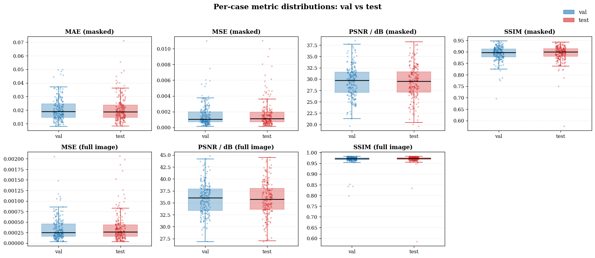
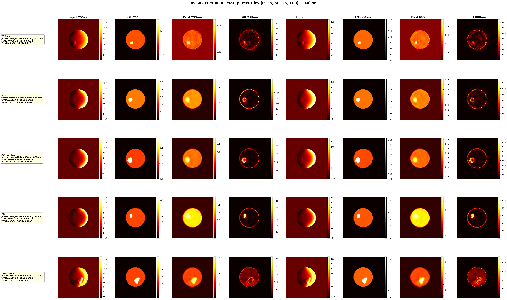
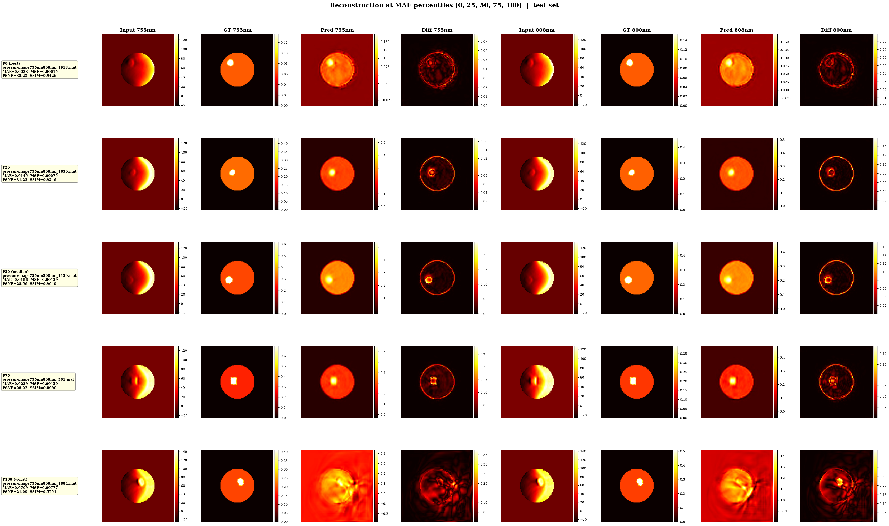

# Evaluation Report: `resnet18_l1_noaug_20260428_211405`

## Per-case metric distributions

## val split

| Metric | Mean | Std | Median | Q25 | Q75 | Min | Max |
|---|---|---|---|---|---|---|---|
| mae | 0.02068 | 0.00820 | 0.01892 | 0.01472 | 0.02464 | 0.00810 | 0.04978 |
| mse | 0.00155 | 0.00139 | 0.00106 | 0.00070 | 0.00197 | 0.00014 | 0.01098 |
| psnr | 29.42458 | 3.41340 | 29.74096 | 27.04582 | 31.54587 | 19.59365 | 38.44899 |
| ssim | 0.89267 | 0.03182 | 0.89675 | 0.87736 | 0.91261 | 0.69532 | 0.94759 |
| mse_full | 0.00034 | 0.00027 | 0.00025 | 0.00016 | 0.00046 | 0.00003 | 0.00205 |
| psnr_full | 35.87221 | 3.25010 | 36.04835 | 33.39199 | 37.88611 | 26.88612 | 44.74673 |
| ssim_full | 0.96852 | 0.02048 | 0.97187 | 0.96674 | 0.97560 | 0.79779 | 0.98295 |

## test split

| Metric | Mean | Std | Median | Q25 | Q75 | Min | Max |
|---|---|---|---|---|---|---|---|
| mae | 0.02075 | 0.00900 | 0.01870 | 0.01452 | 0.02388 | 0.00832 | 0.07093 |
| mse | 0.00167 | 0.00171 | 0.00112 | 0.00069 | 0.00194 | 0.00015 | 0.01100 |
| psnr | 29.35261 | 3.65330 | 29.52063 | 27.11499 | 31.59275 | 19.58455 | 38.25387 |
| ssim | 0.89234 | 0.03651 | 0.89935 | 0.87955 | 0.91393 | 0.57513 | 0.94255 |
| mse_full | 0.00036 | 0.00033 | 0.00027 | 0.00016 | 0.00043 | 0.00004 | 0.00206 |
| psnr_full | 35.83145 | 3.49754 | 35.71660 | 33.61911 | 38.03352 | 26.86080 | 44.50996 |
| ssim_full | 0.96880 | 0.02960 | 0.97245 | 0.96695 | 0.97625 | 0.58426 | 0.98249 |

