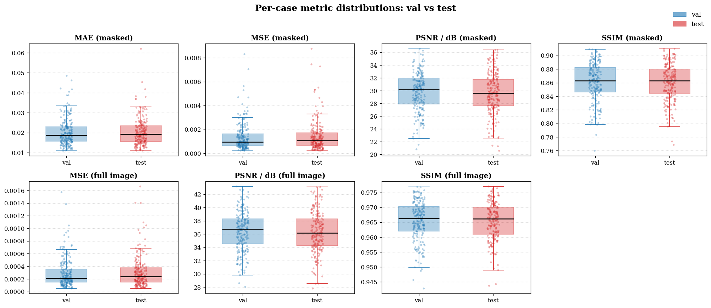
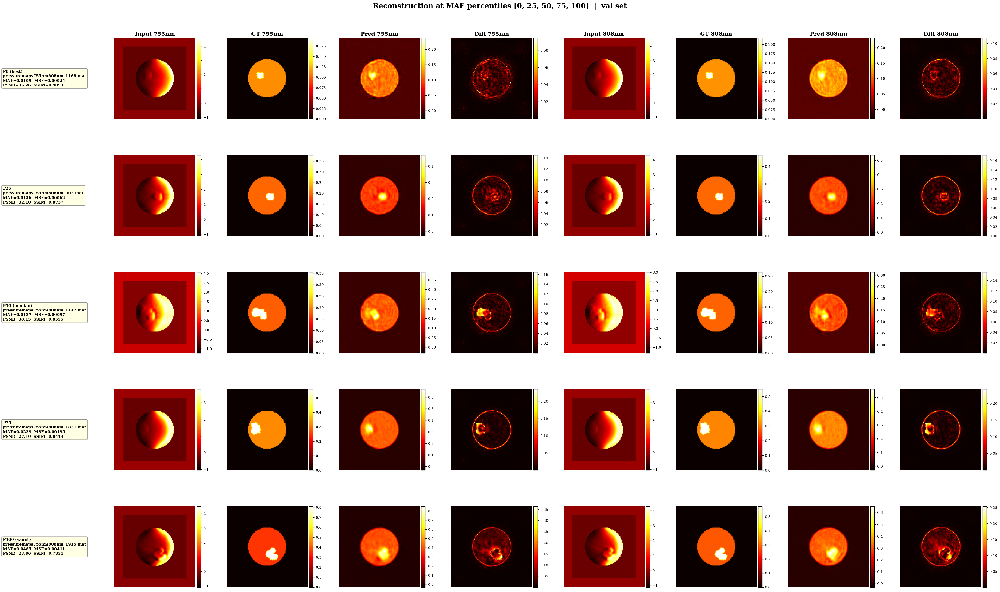
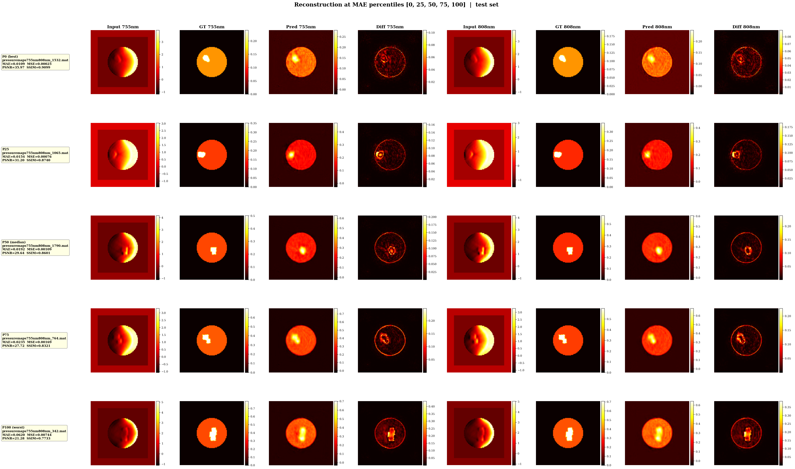

# Evaluation Report: `swinv2_tiny_window8_256_l1_noaug_20260428_210235`

## Per-case metric distributions

## val split

| Metric | Mean | Std | Median | Q25 | Q75 | Min | Max |
|---|---|---|---|---|---|---|---|
| mae | 0.02033 | 0.00680 | 0.01862 | 0.01559 | 0.02289 | 0.01091 | 0.04846 |
| mse | 0.00137 | 0.00117 | 0.00097 | 0.00065 | 0.00162 | 0.00022 | 0.00829 |
| psnr | 29.76732 | 3.05874 | 30.15321 | 27.89352 | 31.90243 | 20.81204 | 36.55704 |
| ssim | 0.86085 | 0.02809 | 0.86307 | 0.84620 | 0.88254 | 0.75969 | 0.90931 |
| mse_full | 0.00029 | 0.00023 | 0.00021 | 0.00015 | 0.00036 | 0.00005 | 0.00157 |
| psnr_full | 36.39159 | 2.98311 | 36.75237 | 34.49577 | 38.33118 | 28.03432 | 43.17555 |
| ssim_full | 0.96540 | 0.00661 | 0.96625 | 0.96197 | 0.97031 | 0.94276 | 0.97687 |

## test split

| Metric | Mean | Std | Median | Q25 | Q75 | Min | Max |
|---|---|---|---|---|---|---|---|
| mae | 0.02039 | 0.00690 | 0.01918 | 0.01541 | 0.02351 | 0.01095 | 0.06200 |
| mse | 0.00145 | 0.00128 | 0.00109 | 0.00067 | 0.00173 | 0.00023 | 0.00875 |
| psnr | 29.60171 | 3.16423 | 29.63994 | 27.62431 | 31.75869 | 20.58230 | 36.38213 |
| ssim | 0.86040 | 0.02717 | 0.86291 | 0.84410 | 0.88001 | 0.76839 | 0.90994 |
| mse_full | 0.00031 | 0.00025 | 0.00024 | 0.00015 | 0.00038 | 0.00005 | 0.00166 |
| psnr_full | 36.26667 | 3.10017 | 36.18645 | 34.22575 | 38.32878 | 27.79323 | 43.08934 |
| ssim_full | 0.96538 | 0.00631 | 0.96616 | 0.96095 | 0.97005 | 0.94367 | 0.97700 |

